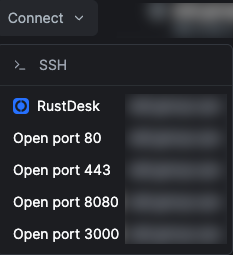
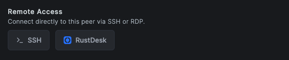

# NetDesk - NetBird to RustDesk Connector

A Chrome extension that adds RustDesk connection buttons to the NetBird dashboard.

## Features

- Adds a "RustDesk" link in the peer context menu on the NetBird dashboard
- Adds a "RustDesk" button on peer detail pages (next to RDP/SSH buttons)
- Automatically detects your operating system (Windows, macOS, Linux, iOS, Android)
- Launches the appropriate RustDesk client for your OS using NetBird IP or domain name
- Supports custom NetBird dashboard URLs
- Configurable button styles (text or icon)
- Injects configurable "Open port" links in the peer action menu to launch service tabs quickly
- Option to enable/disable RustDesk functionality (enabled by default)

## Installation

1. Download or clone this repository
2. Open Chrome and navigate to `chrome://extensions`
3. Enable "Developer mode" in the top right corner
4. Click "Load unpacked" and select the extension directory
5. The extension icon should now appear in your Chrome toolbar

## Usage

### From the peers list:
1. Navigate to your NetBird dashboard (https://app.netbird.io or your custom URL)
2. Right-click on a peer or open its context menu
3. Click the "RustDesk" link (appears above "Open port" options for active peers)
4. The appropriate RustDesk client for your OS will launch with the peer's NetBird IP or domain name

### From a peer detail page:
1. Navigate to a peer detail page (`/peer?id=XXX`)
2. Click the "RustDesk" button (appears next to RDP/SSH buttons)
3. The appropriate RustDesk client for your OS will launch with the peer's NetBird IP or domain name

## Configuration

You can configure the extension by clicking the extension icon and selecting "Options":

- **Enable/Disable RustDesk**: Toggle RustDesk functionality on or off (enabled by default)
- **Custom NetBird URL**: Set a custom NetBird dashboard URL
- **Button Style**: Choose between text or icon-only button styles
- **RustDesk Port**: Set a custom RustDesk port (default: 21118)
- **Service Ports**: Configure the list of ports that appear in the peer action menu (defaults: 80, 443, 8080, 3000)

## How It Works

- The extension uses content scripts to modify the NetBird dashboard page
- It detects peer information from the dashboard (NetBird IP address, domain name, hostname)
- RustDesk links are injected into peer context menus for active peers
- RustDesk buttons are added to peer detail pages next to existing action buttons (RDP, SSH)
- OS detection is performed to launch the correct RustDesk client
- Connections use the peer's NetBird IP address or domain name (FQDN)

## Requirements

- Chrome browser
- RustDesk client installed on your device
- Access to NetBird dashboard

## Limitations

- This extension assumes that peers have the same ID in both NetBird and RustDesk
- The button injection may need adjustment based on the actual NetBird dashboard structure
- Some security settings may prevent the extension from launching external applications

## Troubleshooting

If the RustDesk links/buttons are not appearing on the NetBird dashboard:

1. Check that the extension is enabled in Chrome
2. Verify that RustDesk is enabled in the extension options
3. Verify you're on the correct NetBird dashboard URL (https://app.netbird.io or your custom URL)
4. For context menu links: ensure the peer is active (green status indicator)
5. Open the browser's developer console (F12) and check for any error messages
6. Try running the debug script provided in `debug-content-script.js` in the console
7. Reload the NetBird dashboard page

## Support

For issues or feature requests, please open an issue on this repository.
