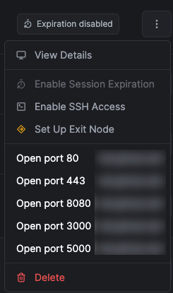

# NetDesk - NetBird to RustDesk Connector

A Chrome extension that adds RustDesk connection buttons to the NetBird dashboard.

## Features

- Adds a "RustDesk" link in the peer context menu on the NetBird dashboard
- **NEW**: Adds specific "Terminal" and "File Transfer" options in the context menu
- Adds a "RustDesk" button on peer detail pages with additional options for Terminal and File Transfer
- Automatically detects your operating system (Windows, macOS, Linux, iOS, Android)
- Launches the appropriate RustDesk client mode (GUI, Terminal, File Transfer)
- Supports custom NetBird dashboard URLs
- Configurable button styles (text or icon)
- Injects configurable "Open port" links in the peer action menu to launch service tabs quickly
- Option to enable/disable RustDesk functionality (enabled by default)

## Installation

1. Download or clone this repository
2. Open Chrome and navigate to `chrome://extensions`
3. Enable "Developer mode" in the top right corner
4. Click "Load unpacked" and select the extension directory
5. The extension icon should now appear in your Chrome toolbar

## Usage

### From the peers list:
1. Navigate to your NetBird dashboard (https://app.netbird.io or your custom URL)
2. Right-click on a peer or open its context menu
3. You will see three RustDesk options for active peers:
    - **Remote Desktop (RustDesk)**: Standard remote control
    - **Terminal (RustDesk)**: Open remote terminal
    - **Transfert (RustDesk)**: Open file transfer window
4. Click the desired option to launch RustDesk in that specific mode

### From a peer detail page:
1. Navigate to a peer detail page (`/peer?id=XXX`)
2. A new "RustDesk" section will appear below the "Remote Access" card
3. This section contains buttons for:
    - **Remote Desktop**: Standard remote control
    - **Terminal**: Open remote terminal
    - **Transfert**: Open file transfer window
4. Click any button to launch the corresponding RustDesk function

## Configuration

You can configure the extension by clicking the extension icon and selecting "Options":

- **Enable/Disable RustDesk**: Toggle RustDesk functionality on or off (enabled by default)
- **Custom NetBird URL**: Set a custom NetBird dashboard URL
- **Button Style**: Choose between text or icon-only button styles
- **RustDesk Port**: Set a custom RustDesk port (default: 21118)
- **Service Ports**: Configure the list of ports that appear in the peer action menu (defaults: 80, 443, 8080, 3000)

## How It Works

- The extension uses content scripts to modify the NetBird dashboard page
- It detects peer information from the dashboard (NetBird IP address, domain name, hostname)
- RustDesk links are injected into peer context menus for active peers
- RustDesk buttons are added to peer detail pages next to existing action buttons (RDP, SSH)
- OS detection is performed to launch the correct RustDesk client
- Connections use the peer's NetBird IP address or domain name (FQDN)

## Requirements

- Chrome browser
- RustDesk client installed on your device
- Access to NetBird dashboard

## Limitations

- This extension assumes that peers have the same ID in both NetBird and RustDesk
- The button injection may need adjustment based on the actual NetBird dashboard structure
- Some security settings may prevent the extension from launching external applications

## Troubleshooting

If the RustDesk links/buttons are not appearing on the NetBird dashboard:

1. Check that the extension is enabled in Chrome
2. Verify that RustDesk is enabled in the extension options
3. Verify you're on the correct NetBird dashboard URL (https://app.netbird.io or your custom URL)
4. For context menu links: ensure the peer is active (green status indicator)
5. Open the browser's developer console (F12) and check for any error messages
6. Try running the debug script provided in `debug-content-script.js` in the console
7. Reload the NetBird dashboard page

## Support

For issues or feature requests, please open an issue on this repository.
